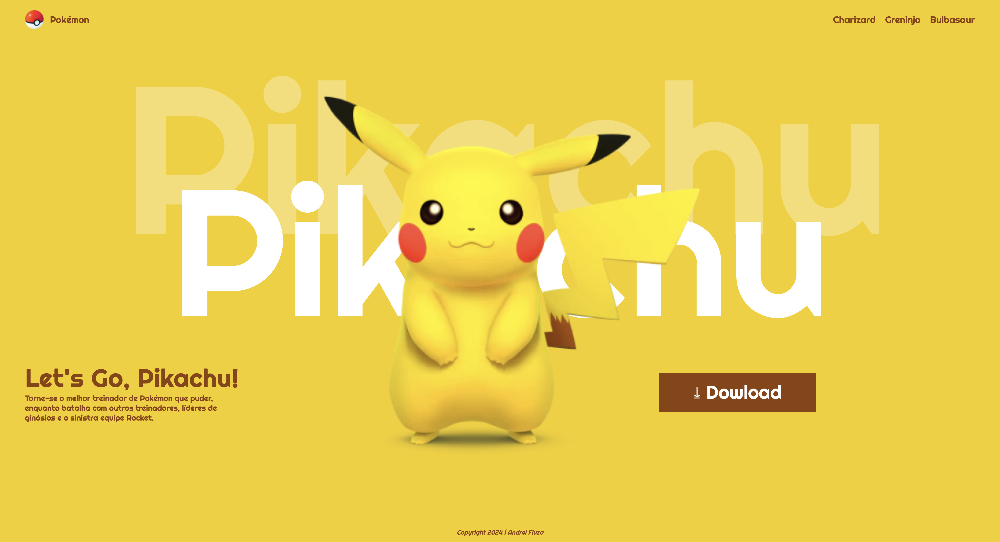

# Landing page - Let's Go, Pikachu

---
## Sobre
Site do tipo landing page para divulgar o jogo do Let's go pikachu.
o intuito desde projeto é colocar em pratica o conhecimento adquirido sobre aas linguagens de marcação, HTML, CSS, e Markdown, no curso tecnico de desenvolvimento de sistemas do [SENAI Jandira](https://sp.senai.br/unidade/jandira/).

---
## Tecnologias utilizadas
-HTML
-CSS
-Markdown
-Git

---
# Autor
- [Andrei Fiuza]()